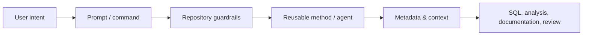

# GitHub Copilot

GitHub Copilot can support analytics development by making standards, reusable methods, documentation patterns, and repository context easier to apply during normal work.

## Enterprise-facing explanation

A governed Copilot ecosystem can include:

| Component | Purpose |
|---|---|
| Instructions | Persistent rules and guardrails |
| Prompts / commands | Repeatable entry points for common tasks |
| Agents | Role-oriented multi-step workflows |
| Skills | Reusable methods applied across workflows |
| Metadata / knowledge | Context that grounds the work |
| Automation | Checks and publishing steps around the workflow |

## Example flow

## What belongs here

- when to use Copilot
- approved patterns
- how to start common workflows
- review expectations
- responsible-use guidance
- examples understandable to practitioners

## What belongs in GitHub technical documentation

- exact folder structure
- agent definitions
- skill files
- command files
- workflow implementation
- scripts and hooks
