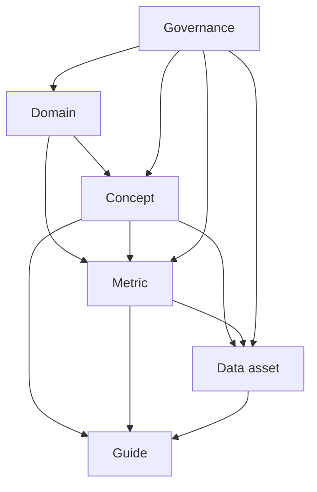

# Content model

The site treats documentation as a small knowledge graph.



## Stable IDs

A filename is a navigation concern. A `kb.id` is the conceptual identity.

Examples:

- `domain.scheduling-access`
- `concept.appointment`
- `metric.no-show-rate`
- `asset.curated-appointment`
- `guide.grain`

Once published, prefer keeping the ID stable even if the title or file path changes.

## Forward relationships

Pages list IDs under `kb.relationships`:

```yaml
kb:
  relationships:
    domains:
      - domain.scheduling-access
    concepts:
      - concept.appointment
    metrics:
      - metric.no-show-rate
```

## Reverse relationships

Do **not** manually maintain “referenced by” lists. The build hook calculates them from forward relationships. This is the main mechanism that prevents cross-reference drift.
