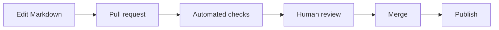

# Content Governance

Rady Forward should be governed as a maintained product.

## Roles

### Page owner
Responsible for accuracy and periodic review.

### Subject-matter contributor
Provides domain expertise and proposes changes.

### Reviewer
Confirms that changes are understandable, accurate, and appropriately scoped.

### Site maintainer
Maintains navigation, build tooling, templates, and publishing automation.

## Change workflow

## Review cadence

Not every page needs the same review frequency.

| Page type | Suggested review |
|---|---|
| Active standard | At least annually and after major platform/process change |
| System overview | After major architecture/platform change |
| Runbook | After workflow change |
| Governance page | When membership/decision rights change |
| Learning content | Periodically as tools and practices evolve |

## Deprecation

Do not silently delete historical standards when users may still encounter them.

Mark them as deprecated, point to the replacement, and remove from primary navigation when appropriate.
