# Analytics Standardization Initiative

This initiative organizes the work required to improve consistency, reproducibility, usability, adoption, and governance of analytical methods.

## Current driver diagram

```mermaid
%%{init: {
  "theme": "base",
  "htmlLabels": true,
  "themeVariables": {
    "fontSize": "12px",
    "fontFamily": "Tahoma, Arial, sans-serif",
    "primaryTextColor": "#333333",
    "lineColor": "#7A7A7A"
  },
  "flowchart": {
    "nodeSpacing": 30,
    "rankSpacing": 100,
    "padding": 15
  }
}}%%

flowchart LR

classDef aim fill:#FFFFFF,stroke:#0077A3,stroke-width:2px,color:#333333;
classDef driver fill:#FFFFFF,stroke:#0077A3,stroke-width:1.5px,color:#333333;
classDef inprogress fill:#DCEBFF,stroke:#0077A3,stroke-width:1.5px,color:#333333;
classDef notstarted fill:#F2F2F2,stroke:#0077A3,stroke-width:1.5px,color:#333333;

%% --- SMART AIM ---
subgraph SMART["Smart Aim"]
direction TB
SA["By December 2026, >=75% of priority recurring analyses within the team will use standardized R templates, reusable functions, validated data access patterns, and documented workflows to improve consistency, reproducibility, and trust in analytic outputs."]
end

%% --- DRIVERS ---
subgraph DRIVERS["Primary Drivers"]
direction TB
KD1["Standardized and Validated Methods and R Package Foundation"]
KD2["Standardized Workflows and Guided Analytics"]
KD3["Adoption Through Usability and Real Workflows"]
KD4["Governance, Quality, and Continuous Improvement"]
end

%% --- INTERVENTIONS ---
subgraph INTERVENTIONS["Interventions"]
direction TB

%% METHODS + PACKAGE
I1["Establish guiding principles for standardization to ensure consistency in structure while preserving analytic judgment"]
I2["Implement standardized analytic methods to reduce variation across descriptive, diagnostic, and PI/QI analyses"]
I3["Standardize core calculations and analytic logic to ensure consistent and reproducible results across projects"]
I4["Introduce an enterprise R package as the foundation for delivering validated and reusable analytic methods"]
I5["Enable consistent use of the R package through clear documentation, examples, and embedded usage guidance"]
I6["Introduce standardized R project structures to ensure reproducibility, transparency, and consistency in analytic workflows"]

%% WORKFLOW + GUIDED ANALYTICS
I7["Implement reusable reporting templates to produce consistent, polished, and reproducible analytic outputs"]
I8["Establish a guided analytics workflow to structure analyses from business question through decision-making"]
I9["Standardize data access patterns to ensure reliable, consistent, and scalable data retrieval across analyses"]

%% ADOPTION
I10["Enable secure and frictionless access to the enterprise R package to reduce barriers to adoption"]
I11["Pilot standardized workflows within real projects to demonstrate value and drive adoption"]
I12["Reduce reliance on manual Excel-based workflows by transitioning repeatable analyses into standardized R processes"]
I13["Establish output design standards to ensure analyses are tailored appropriately to different stakeholder needs"]
I14["Ensure standardized workflows are accessible and usable across varying analyst skill levels"]
I15["Introduce a consumable learning series to build capability and reinforce consistent use of standardized methods and workflows"]

%% GOVERNANCE
I16["Implement peer review processes to ensure analytic quality, consistency, and adherence to standards"]
I17["Establish validation mechanisms to ensure analytic outputs are accurate, reliable, and reproducible"]
I18["Introduce processes to evaluate and update legacy analyses to align with standardized methods"]
I19["Establish version control and revision standards to ensure transparency and traceability in analytic work"]
I20["Monitor variation, adoption, and rework to identify opportunities for improvement and reinforce standardization"]
I21["Establish governance processes to maintain, evolve, and enforce analytic standards over time"]

end

%% --- Apply styles ---
class SA aim;
class KD1,KD2,KD3,KD4 driver;

%% --- STATUS ---
class I1 notstarted;
class I2 notstarted;
class I3 notstarted;
class I4 notstarted;
class I5 notstarted;
class I6 inprogress;
class I7 notstarted;
class I8 notstarted;
class I9 notstarted;
class I10 inprogress;
class I11 notstarted;
class I12 notstarted;
class I13 notstarted;
class I14 notstarted;
class I15 notstarted;
class I16 notstarted;
class I17 notstarted;
class I18 notstarted;
class I19 notstarted;
class I20 notstarted;
class I21 notstarted;

%% --- Layout ---
style SMART fill:#FFFFFF,stroke:#FFFFFF,color:#0077A3
style DRIVERS fill:#FFFFFF,stroke:#FFFFFF,color:#0077A3
style INTERVENTIONS fill:#FFFFFF,stroke:#FFFFFF,color:#0077A3

%% --- FLOW ---
SA --> KD1
SA --> KD2
SA --> KD3
SA --> KD4

KD1 --> I1
KD1 --> I2
KD1 --> I3
KD1 --> I4
KD1 --> I5
KD1 --> I6

KD2 --> I7
KD2 --> I8
KD2 --> I9

KD3 --> I10
KD3 --> I11
KD3 --> I12
KD3 --> I13
KD3 --> I14
KD3 --> I15

KD4 --> I16
KD4 --> I17
KD4 --> I18
KD4 --> I19
KD4 --> I20
KD4 --> I21
```

