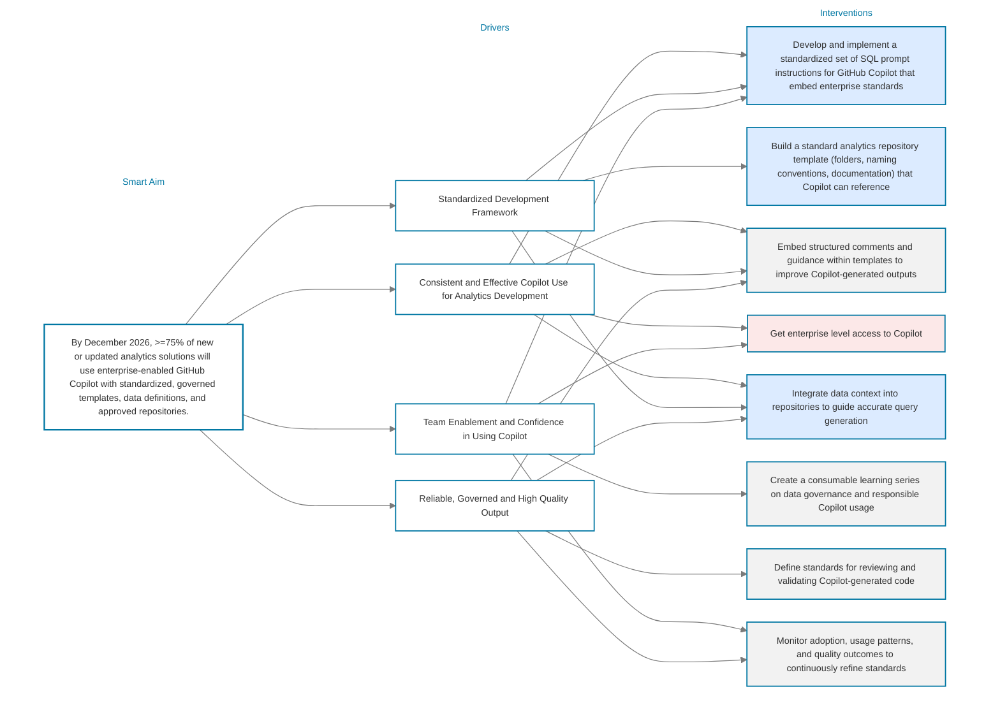

# Enterprise-Enabled Copilot Initiative

This initiative organizes the work required to establish consistent, governed, usable AI-assisted development.

## Current driver diagram

A [Key Driver Diagram](https://www.ihi.org/library/tools/driver-diagram) helps organize ideas and identify the primary factors that contribute to the issue being improved.

<b>Intervention Status Legend</b> 
🟦 In Progress &nbsp;&nbsp; 🟩 Completed &nbsp;&nbsp; 🟥 Delayed &nbsp;&nbsp; ⬜ Not Started

