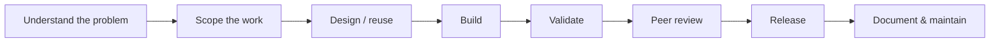

# How We Work

This section describes the operating model for analytics work from initial request through delivery and maintenance.

## Core workflow

## Core principles

- **Start with the business question.**
- **Reuse before rebuilding.**
- **Keep work small enough to deliver.**
- **Validate before release.**
- **Make review and documentation part of development.**
- **Finish work before starting excessive new work.**
- **Treat follow-up analysis as new, explicitly scoped work when scope materially changes.**
