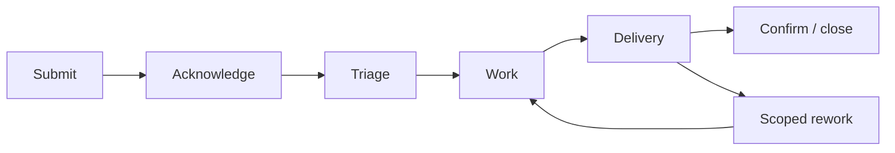

# Research Administration Support

This page is a **public-safe framework** for documenting the analytics support model for research requests.

The detailed internal SLA should be published only in an approved internal environment.

## What this page should explain

- services analytics provides to research teams
- what is outside analytics scope
- how requests are submitted and triaged
- how complexity affects expected turnaround
- requester responsibilities
- how validation and delivery work
- how funded or time-sensitive requests affect prioritization
- governance and compliance expectations

## Recommended lifecycle

!!! warning "Internal details"
    Keep named contacts, detailed SLA exceptions, internal queue rules, specific system paths, and security-sensitive procedures in an approved internal page.
