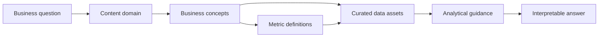

# Data Knowledge Base

This site connects the **business meaning of the work** to the **technical structures that represent it in data**.

-   :material-map-marker-path: **Explore a content domain**

    Start with the operational area you are trying to understand: scheduling and access, inpatient care, emergency care, outpatient care, or surgical services.

    [Browse domains](domains/index.md)

-   :material-book-open-variant: **Understand a business concept**

    Learn how concepts such as appointment, encounter, referral, provider, department, and patient class are represented analytically.

    [Browse concepts](concepts/index.md)

-   :material-calculator-variant: **Define a metric**

    See the population, numerator, denominator, time basis, exclusions, and common interpretation problems behind important measures.

    [Browse metrics](metrics/index.md)

-   :material-database-search: **Find a curated data asset**

    Use documented curated tables, views, and functions as recommended analytical entry points. Exhaustive object discovery belongs in Alation.

    [Browse data assets](data-assets/index.md)

-   :material-sign-direction: **Start with a question**

    Use question-to-data pathways to move from a business question to the right concepts, dates, metrics, and assets.

    [Browse guides](guides/index.md)

-   :material-shield-check: **Understand trust and ownership**

    Learn how definitions are governed, how changes are handled, and who is responsible for business meaning and technical implementation.

    [Browse governance](governance/index.md)

## The core model

The site is designed around stable metadata relationships rather than navigation alone. A concept can belong to several domains, a metric can depend on several concepts, and a curated asset can support several questions without duplicating the underlying explanation.

--8<-- "includes/snippets/alation-boundary.md"
