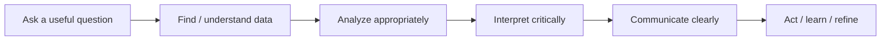

# Learning

The learning section should build practical capability, not just teach tool clicks.

The central goal is to help people **ask better questions, evaluate evidence, interpret results, and use AI appropriately**.

## Learning model

Content can be organized by persona and data-literacy level so a novice manager does not receive the same experience as an advanced data practitioner.
