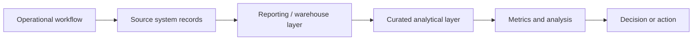

# How our data works

Operational systems are optimized to support care and business workflows. Analytical systems reorganize those records so they can be used consistently for reporting, measurement, and analysis.

## Why a curated layer exists

A curated layer should absorb recurring technical complexity:

- joining related source records
- applying stable inclusion and exclusion logic
- standardizing identifiers and dimensions
- resolving common timestamp choices
- representing useful analytical grains
- exposing derived fields that would otherwise be recreated inconsistently

A curated table is not automatically the answer to every question. It is a **recommended starting point with an explicit grain and purpose**.

## Why source records and analytical concepts differ

Operational systems often contain several records for what a person informally thinks of as one thing. An appointment can be created, rescheduled, canceled, recreated, linked to an encounter, and associated with multiple timestamps. An analytical representation must decide which events and states matter for the intended use.

That is why this site documents both the **concept** and the **asset**.
