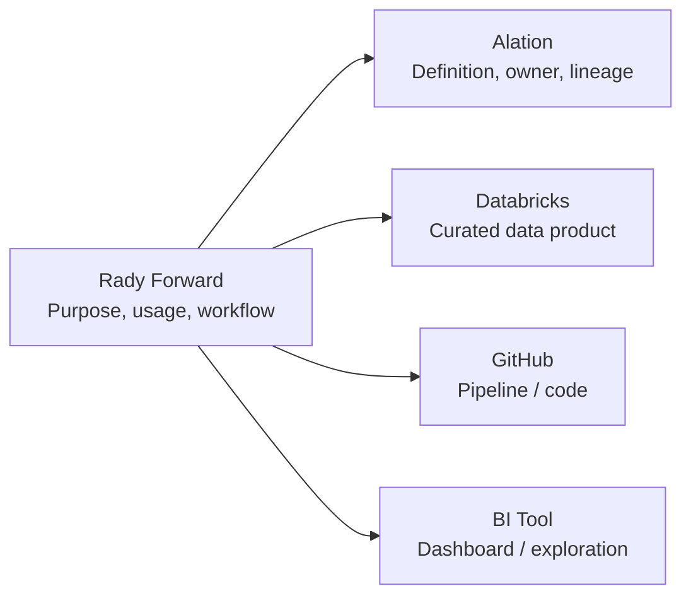

# Platform & Source-of-Truth Map

Different platforms serve different purposes. Rady Forward should connect them rather than duplicate them.

| Platform | Primary question | Typical content |
|---|---|---|
| **Rady Forward** | How do we work with data? | Standards, workflows, playbooks, system context, learning, decision guidance |
| **Alation** | What does this data mean, who owns it, and where did it come from? | Catalog metadata, definitions, ownership, lineage, certification |
| **Databricks** | Where does data live and how is it transformed or computed? | Tables, pipelines, notebooks, transformations, jobs, compute |
| **GitHub** | What implements this? | SQL, code, configuration, tests, automation, version history |
| **BI / analytics tools** | How do users consume and explore the result? | Dashboards, semantic layers, reports, interactive analysis |

## Example

A scheduled-appointments data product might be represented across systems like this:

The Rady Forward page should explain the product well enough to orient the user, but should not recreate every field definition, SQL transformation, or dashboard configuration.
