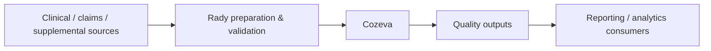

# Cozeva

Cozeva is an example of a system where a Rady Forward page can add value by explaining the **end-to-end business and operational context** around data movement.

## What belongs on the knowledge hub

- the purpose of the platform
- the types of information exchanged
- major upstream and downstream systems
- the broad refresh cadence
- terminology users need to understand the workflow
- ownership and support model
- known transition or modernization considerations

## High-level flow

!!! warning "Internal technical details"
    Detailed file names, internal database objects, SFTP locations, network paths, server names, and operational job steps should be maintained in approved internal technical documentation, not a public proof-of-concept site.
