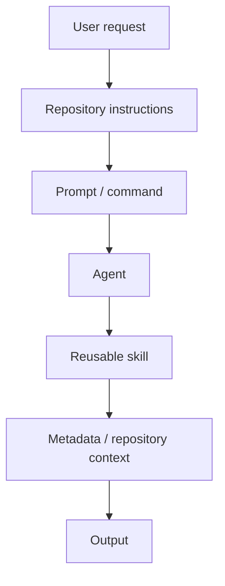

# Copilot Framework Reference

The detailed Copilot implementation should remain in GitHub as version-controlled technical documentation.

## Conceptual architecture

## Technical documentation can include

- instruction hierarchy
- prompt and command conventions
- agent responsibilities
- reusable skills
- metadata strategy
- validation scripts
- GitHub Actions
- test patterns
- implementation examples

The enterprise-facing GitHub Copilot page should link here for users who need to understand implementation details.
